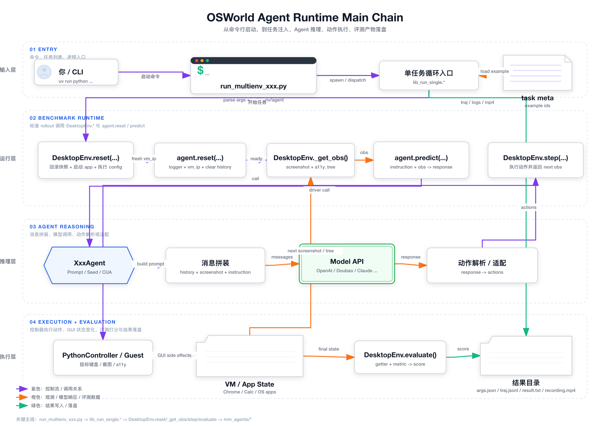
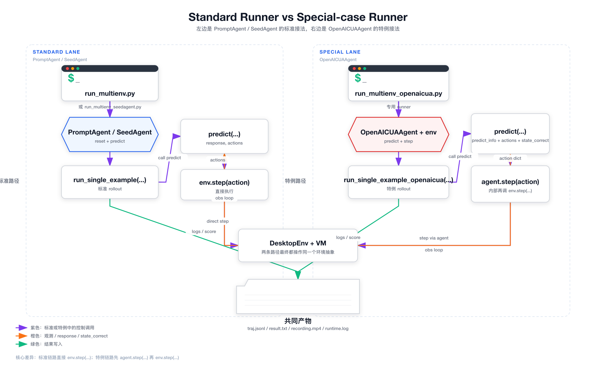
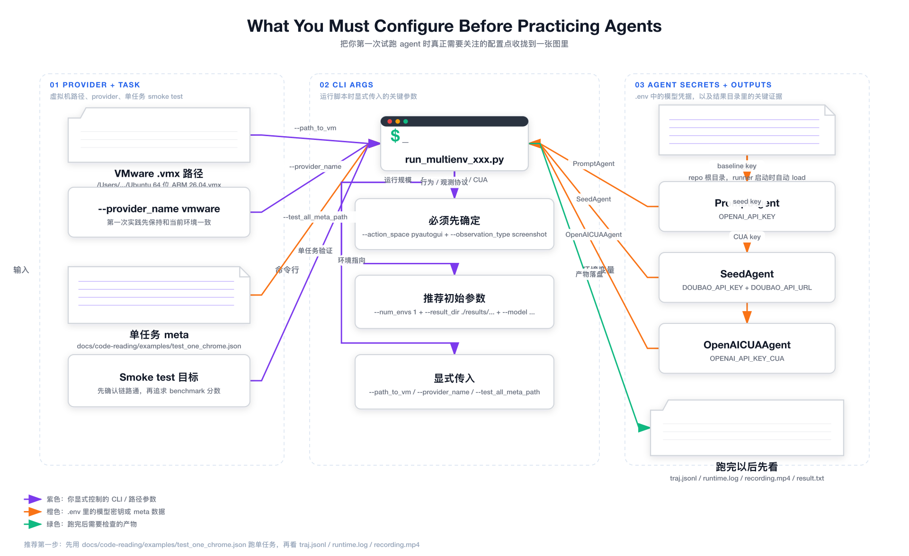

# 18 Agent 详细链路图

这一篇接在 [17 三个典型 Agent 接入例子与实际运行](./17-typical-agent-integration-examples_zh.md) 后面看最合适。

前面你已经知道：

- 这个项目的主链路是什么
- 新 agent 的最小接入模板是什么
- `PromptAgent`、`SeedAgent`、`OpenAICUAAgent` 分别代表哪种接法

但如果你真的要开始动手实践 agent，这时候最容易卡住的问题通常不是“概念不懂”，而是：

- 整个调用链到底是怎么串起来的？
- 标准 runner 和特例 runner 的分叉点到底在哪里？
- 我第一次试跑前，到底要先配哪些东西？

这一篇就只做这件事：把这些关系画成图，然后配上最少但关键的文字说明。

## 一、总链路图

这张图回答的是：

- 从 `uv run python scripts/python/run_multienv_xxx.py` 开始，到最后 `result.txt`、`traj.jsonl`、`recording.mp4` 落盘，中间究竟经过了哪些关键节点？

图文件：

- [agent-main-chain.svg](/Users/bytedance/PycharmProjects/test5/osworld/docs/code-reading/assets/agent-diagrams/agent-main-chain.svg)
- [agent-main-chain.png](/Users/bytedance/PycharmProjects/test5/osworld/docs/code-reading/assets/agent-diagrams/agent-main-chain.png)

### 怎么读这张图

建议按层从上到下看：

1. `Entry`
   你启动 runner，runner 读取 task meta，并进入单任务循环入口。
2. `Benchmark Runtime`
   `lib_run_single.*` 按顺序调用：
   `DesktopEnv.reset(...) -> agent.reset(...) -> DesktopEnv._get_obs() -> agent.predict(...) -> DesktopEnv.step(...)`
3. `Agent Reasoning`
   `agent.predict(...)` 内部又会继续展开成：
   `XxxAgent -> 消息拼装 -> Model API -> 动作解析 / 适配`
4. `Execution + Evaluation`
   `DesktopEnv.step(...)` 通过 controller 真正驱动 VM 内应用，最后 `DesktopEnv.evaluate()` 打分，并把结果写到结果目录。

### 这张图里最重要的 4 个观察点

1. `lib_run_single.*` 是 benchmark 把 environment 和 agent 真正绑在一起的地方。
2. `agent.predict(...)` 不是终点，它内部通常还要继续调用模型 API，再把模型回复转成动作。
3. 动作真正落到 GUI 上，不是 agent 直接做，而是 `DesktopEnv.step(...) -> controller -> VM / App State` 这条线在做。
4. 你最终调试时最该看的证据，不在抽象接口里，而在结果目录里。

## 二、标准路径 vs 特例路径

这张图回答的是：

- 为什么 `PromptAgent` 和 `SeedAgent` 能继续复用标准 `run_single_example(...)`
- 而 `OpenAICUAAgent` 必须单独走 `run_single_example_openaicua(...)`

图文件：

- [agent-standard-vs-special.svg](/Users/bytedance/PycharmProjects/test5/osworld/docs/code-reading/assets/agent-diagrams/agent-standard-vs-special.svg)
- [agent-standard-vs-special.png](/Users/bytedance/PycharmProjects/test5/osworld/docs/code-reading/assets/agent-diagrams/agent-standard-vs-special.png)

### 左边：标准路径

标准路径对应：

- [scripts/python/run_multienv.py](../../scripts/python/run_multienv.py)
- [scripts/python/run_multienv_seedagent.py](../../scripts/python/run_multienv_seedagent.py)
- [lib_run_single.py](../../lib_run_single.py)
  里的 `run_single_example(...)`

核心特征只有两条：

1. agent 只需要对外提供 `reset(...)` 和 `predict(...)`
2. rollout 直接调用 `env.step(action)`

也就是说，agent 负责“想下一步做什么”，environment 负责“真的去做”。

### 右边：特例路径

特例路径对应：

- [scripts/python/run_multienv_openaicua.py](../../scripts/python/run_multienv_openaicua.py)
- [mm_agents/openai_cua_agent.py](../../mm_agents/openai_cua_agent.py)
- [lib_run_single.py](../../lib_run_single.py)
  里的 `run_single_example_openaicua(...)`

它和标准路径的关键差异是：

1. `OpenAICUAAgent` 在初始化时就拿到了 `env`
2. rollout 不再直接 `env.step(...)`
3. 而是先走 `agent.step(action)`，再由 agent 内部调用 `env.step(...)`

这就是为什么它必须专门写一条 runner 和 rollout，而不能直接复用标准版。

### 你自己接新 agent 时，应该优先模仿哪边

结论很明确：

- 第一版优先模仿左边
- 不要一开始就模仿右边

原因不是右边不好，而是右边已经不是“最小接入路径”，而是“特殊协议适配路径”了。

## 三、实践前配置图

这张图回答的是：

- 在你真的开始跑 agent 之前，哪些参数和环境变量必须先明确？

图文件：

- [agent-config-map.svg](/Users/bytedance/PycharmProjects/test5/osworld/docs/code-reading/assets/agent-diagrams/agent-config-map.svg)
- [agent-config-map.png](/Users/bytedance/PycharmProjects/test5/osworld/docs/code-reading/assets/agent-diagrams/agent-config-map.png)

### 这张图最值得记住的 3 类配置

#### 1. Provider + Task

第一次实践，最重要的是：

- `--provider_name`
- `--path_to_vm`
- `--test_all_meta_path`

对你当前环境来说，最稳的选择仍然是：

- `provider_name=vmware`
- `path_to_vm` 传你的 `.vmx` 路径
- `test_all_meta_path` 先用单任务文件：
  [docs/code-reading/examples/test_one_chrome.json](./examples/test_one_chrome.json)

#### 2. CLI Args

第一次别一上来乱试参数组合。

建议先固定：

- `--action_space pyautogui`
- `--observation_type screenshot`
- `--num_envs 1`

也就是说，先把复杂度压到最低，只验证：

- 环境能启动
- agent 能收到观测
- agent 能回动作
- 动作能真的落到 VM 里

#### 3. Agent Secrets

当前这几条典型链路，对应的最小 `.env` 配置分别是：

- `PromptAgent`: `OPENAI_API_KEY`
- `SeedAgent`: `DOUBAO_API_KEY` + `DOUBAO_API_URL`
- `OpenAICUAAgent`: `OPENAI_API_KEY_CUA`

这个区别一定要记住。

因为你后面如果“命令没错但还是跑不起来”，非常大的概率不是 runner 逻辑问题，而是：

- 模型 key 没配
- 配了错误的 key 名
- 模型能力和脚本期望不匹配

## 四、把这三张图合起来看，你应该得到什么认知

如果这三张图看懂了，你脑子里应该至少形成下面这个顺序：

1. 入口层：
   你启动的是 `run_multienv_xxx.py`
2. 绑定层：
   runner 会创建 `DesktopEnv` 和某个 `XxxAgent`
3. rollout 层：
   `lib_run_single.*` 决定标准调用链怎么跑
4. agent 层：
   `predict(...)` 内部会再展开成“消息拼装 -> 模型调用 -> 动作解析”
5. execution 层：
   真正驱动 GUI 的是 `DesktopEnv.step(...)`
6. evidence 层：
   跑完后最重要的是看 `traj.jsonl`、`runtime.log`、`recording.mp4`、`result.txt`

只要这 6 层关系是清楚的，后面你无论是接现有 agent，还是自己写新 agent，都不会太乱。

## 五、我建议你接下来如何开始实践

看完这页以后，最推荐的实践顺序不是继续读，而是马上跑最短路径。

### 第一步

先从 `PromptAgent` 开始，不要先碰 `OpenAICUAAgent`。

原因：

- 它最标准
- 链路最短
- 更适合作为你第一次打通 agent 实践主线的样板

### 第二步

先跑单任务，不跑整域。

也就是用：

- [docs/code-reading/examples/test_one_chrome.json](./examples/test_one_chrome.json)

先把链路打通。

### 第三步

跑完后不要第一时间只盯控制台。

而是先看：

- `traj.jsonl`
- `runtime.log`
- `recording.mp4`

这三样最能帮你理解：

- agent 到底看到了什么
- agent 到底输出了什么
- VM 里到底发生了什么

## 下一步建议

这一步的文档和图已经把主链路摆清楚了。下一步最自然的动作，不是继续补概念，而是开始配置和试跑。

建议顺序：

1. 先确认你要跑哪条链路
2. 先确认对应 `.env` 变量
3. 先用单任务命令跑起来
4. 跑完我们一起看结果产物

如果你继续，我建议我们下一步直接开始：

- 配 `PromptAgent` 的 `.env`
- 跑 `test_one_chrome.json`
- 然后我带你逐个看 `traj.jsonl`、`runtime.log`、`recording.mp4`
