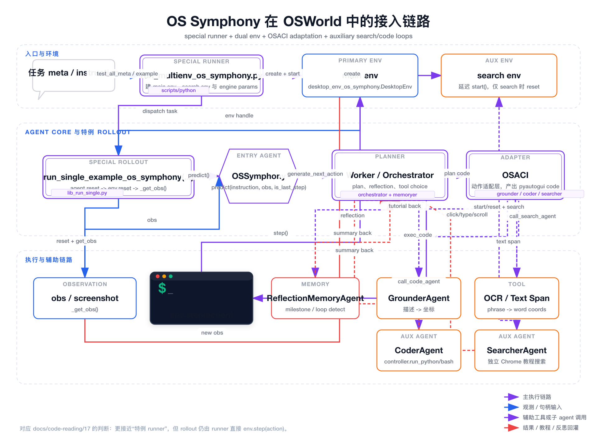

# 25 OS Symphony 接入链路与代码走读

这一篇最适合接在 [17 三个典型 Agent 接入例子与实际运行](./17-typical-agent-integration-examples_zh.md) 和 [18 Agent 详细链路图](./18-agent-chain-diagrams_zh.md) 后面看。

前面你已经知道：

- `PromptAgent` / `SeedAgent` 是标准路径
- `OpenAICUAAgent` 是典型 special-case runner
- 新 agent 接入时，最重要的是先看清 runner、rollout、agent 三层到底谁在负责什么

`OS Symphony` 这条线之所以值得单独拆开，是因为它既不是最简单的标准路径，也不是完全像 `OpenAICUAAgent` 那样把 `env.step(...)` 包进 agent 内部。

它的真实形态更接近：

- special runner
- special rollout
- 双环境协同
- 多子 agent 适配层

如果你直接进 `mm_agents/os_symphony/` 看，很容易被一大堆模块打散。

这一篇只做 4 件事：

1. 先把这条链路整体摆平
2. 再看它相对 OSWorld 主线到底改了什么
3. 再看 `predict(...)` 主循环在这里是怎么展开的
4. 最后给一个当前仓库下可操作的 demo 跑法

## 一、先看总图

图文件：

- [os_symphony-integration-flow.svg](/Users/bytedance/PycharmProjects/test5/osworld/docs/diagrams/os_symphony-integration-flow.svg)
- [os_symphony-integration-flow.png](/Users/bytedance/PycharmProjects/test5/osworld/docs/diagrams/os_symphony-integration-flow.png)



这张图最想表达的不是“模块很多”，而是下面这 5 个事实：

1. 入口不是标准 `run_multienv.py`，而是专用的 [scripts/python/run_multienv_os_symphony.py](../../scripts/python/run_multienv_os_symphony.py)。
2. 这条线会同时创建：
   - 主任务 `env`
   - 搜索子任务 `search_env`
3. `OSSymphony` 本体其实很薄，真正的主逻辑主要在：
   - [mm_agents/os_symphony/agents/worker.py](../../mm_agents/os_symphony/agents/worker.py)
   - [mm_agents/os_symphony/agents/os_aci.py](../../mm_agents/os_symphony/agents/os_aci.py)
4. rollout 不是标准 `run_single_example(...)`，而是：
   - [lib_run_single.py](../../lib_run_single.py)
     里的 `run_single_example_os_symphony(...)`
5. 它虽然是特例 rollout，但动作最终仍然是：
   - runner 直接 `env.step(action, ...)`

也就是说，它和 `OpenAICUAAgent` 的最大差别是：

- `OpenAICUAAgent`：
  `agent.step(...) -> env.step(...)`
- `OS Symphony`：
  `agent.predict(...) -> runner 直接 env.step(...)`

## 二、先记住它在 OSWorld 里属于哪一种接法

如果按照 [17](./17-typical-agent-integration-examples_zh.md) 的三分法来归类，`OS Symphony` 最接近的是：

- 特例 agent
- 特例 runner
- 特例 rollout

但要补一层精确说明：

- 它不是 `OpenAICUAAgent` 那种“agent 自己接管 step”
- 它更像“标准 `env.step(...)` 仍保留，但 runner 和 rollout 都已经为了双环境与多子 agent 协同发生了明显分叉”

所以更准确的理解是：

- 它已经不属于 `PromptAgent` / `SeedAgent` 那种标准接入
- 但它也不是 `OpenAICUAAgent` 那种最重的 special-case

## 三、入口脚本到底做了什么

第一次读 [scripts/python/run_multienv_os_symphony.py](../../scripts/python/run_multienv_os_symphony.py) 时，建议你只盯 3 件事：

1. 它创建了哪些环境对象
2. 它组装了哪些模型参数
3. 它最后调用了哪个 rollout

### 1. 这条线先把参数拆成 5 组 engine params

对应文件下半段的 `test(...)`，它会分别组装：

- `engine_params_for_orchestrator`
- `engine_params_for_grounder`
- `engine_params_for_coder`
- `engine_params_for_memoryer`
- `engine_params_for_searcher`

也就是说，这条线不是“一个 Agent + 一个模型”。

它是：

- 主编排模型
- grounding 模型
- code agent 模型
- reflection memory 模型
- search agent 模型

分开配置、分开注入。

这就是为什么它的命令行参数看起来比标准 runner 长很多。

### 2. 每个 worker 里会同时创建两个环境

对应 `run_env_tasks(...)`。

它先创建主 `env`，然后再创建 `search_env`。

主 `env` 用于真正跑 benchmark 任务。

`search_env` 则专门供 `SearcherAgent` 打开浏览器、搜索教程、生成辅助提示用。

这一点和标准路径完全不一样。

标准路径通常只有：

- 一个 `DesktopEnv`

而这里是：

- 一个主执行环境
- 一个隔离搜索环境

### 3. 当前代码实际上只支持 `docker` 和 `aws`

这里要特别注意一个代码事实：

在 `run_env_tasks(...)` 里，主 `env` 和 `search_env` 都只分支处理了：

- `aws`
- `docker`

其他 provider 会直接抛异常。

所以你不能把这条线按 `PromptAgent` 那种思路，直接改成：

- `--provider_name vmware`

然后期待它自然跑起来。

### 4. 当前脚本本身还有一个导入顺序小坑

这个文件在把 repo 根目录插进 `sys.path` 之前，就先 import 了：

- `mm_agents.os_symphony.agents.os_symphony`
- `mm_agents.os_symphony.agents.os_aci`

所以如果你从 repo 根目录直接执行：

```bash
python3 scripts/python/run_multienv_os_symphony.py ...
```

很可能先遇到：

```text
ModuleNotFoundError: No module named 'mm_agents'
```

当前仓库下更稳的调用方式是：

```bash
PYTHONPATH=. python3 scripts/python/run_multienv_os_symphony.py ...
```

这不是算法问题，而是当前脚本初始化顺序的问题。

## 四、为什么这里要专门 fork 一个 `desktop_env_os_symphony.py`

对应文件：

- [desktop_env/desktop_env_os_symphony.py](../../desktop_env/desktop_env_os_symphony.py)

它不是完全重写了 `DesktopEnv`，而是在标准环境上做了两处关键改造。

### 1. 把环境启动拆成了延迟 `start()`

标准环境在 `__init__` 阶段就会初始化 provider、启动 emulator。

而 `desktop_env_os_symphony.py` 改成了：

- `__init__` 只保存配置
- 真正启动放到 `start()`

这样做的直接目的，是让：

- 主 `env`
- `search_env`

都可以先被创建出来，再按需要分别启动。

这对双环境协同很重要。

尤其是 `SearcherAgent` 这条线，它会在真正调用搜索时才触发：

- `self.env.start()`

### 2. 允许没有 `evaluator` 的任务也能 `reset(...)`

`search_env` 跑的不是正式 benchmark 任务，而是一个临时拼出来的“搜索任务”。

这种任务只有：

- `instruction`
- `config`

不一定有正式 `evaluator`。

所以 `desktop_env_os_symphony.py` 在 `_set_evaluator_info(...)` 里多加了一层：

- 如果 `task_config` 没有 `evaluator`，就直接返回

这一步是为了让 `SearcherAgent` 的伪任务能正常进环境，不会因为缺少评测定义而崩掉。

## 五、`OSSymphony` 本体其实很薄，真正的主逻辑不在这里

对应文件：

- [mm_agents/os_symphony/agents/os_symphony.py](../../mm_agents/os_symphony/agents/os_symphony.py)

第一次看这个类时，最重要的结论反而是：

- 不要把主要精力花在这里

因为它本身只做两件事：

1. `reset(...)` 时创建一个 `Worker`
2. `predict(...)` 时把调用转发给 `self.executor.generate_next_action(...)`

也就是说，这个类更像一个非常薄的门面层。

真正的决策、反思、工具调用、动作翻译，主要都不在这里。

你如果误以为“主入口类一定最重要”，反而会被误导。

## 六、真正的适配核心是 `OSACI`

对应文件：

- [mm_agents/os_symphony/agents/os_aci.py](../../mm_agents/os_symphony/agents/os_aci.py)

这个类名字看起来像普通 agent，但其实更像：

- 动作适配层
- 多工具封装层
- 主 agent 与 OSWorld 环境之间的桥

### 1. 它在初始化时就把 4 类能力都装进来了

初始化阶段会配置：

- `GrounderAgent`
- OCR / Text Span Agent
- `CoderAgent`
- `SearcherAgent`

所以 `OSACI` 的职责不是“决定要做什么”，而是：

- 把高层 planner 决定的动作落成具体可执行代码
- 或把某个复杂子任务转发给 code/search 子 agent

### 2. 它暴露的是一组 `agent_action`

例如：

- `click(...)`
- `type(...)`
- `scroll(...)`
- `drag_and_drop(...)`
- `highlight_text_span(...)`
- `locate_cursor(...)`
- `call_code_agent(...)`
- `call_search_agent(...)`
- `done()`
- `fail()`

这些动作表面上像“工具 API”，但底层都会返回两样东西：

1. 可执行的 `pyautogui` / shell / wait 代码
2. 一个结构化 `action_dict`

真正喂给 OSWorld 执行的是前者。

后者主要用于：

- 坐标可视化
- 反思
- 日志
- 行为追踪

### 3. `call_search_agent(...)` 是这条线最特别的地方之一

`call_search_agent(...)` 不会立即去碰主任务环境。

它会：

1. 把当前结果目录传给 `SearcherAgent`
2. 用当前主屏截图作为上下文
3. 在 `search_env` 里搜索教程
4. 把结果写回：
   - `self.last_search_agent_result`
   - `self.tutorials`

后面 `Worker` 会把这些教程重新塞回系统 prompt。

所以这条链的设计不是“搜完把答案直接当下一步动作”，而是：

- 搜完先补知识
- 再由主 orchestrator 继续决策

## 七、`Worker.generate_next_action(...)` 才是这条线真正的 `predict` 主循环

对应文件：

- [mm_agents/os_symphony/agents/worker.py](../../mm_agents/os_symphony/agents/worker.py)

如果你只打算精读一个函数，就读：

- `generate_next_action(...)`

这基本就是 `OS Symphony` 在 OSWorld 里的真实推理主循环。

### 1. 它先把 screenshot 和 instruction 挂到 `OSACI`

一开始先做：

- `self.os_aci.assign_screenshot(obs)`
- `self.os_aci.set_task_instruction(instruction)`

这一步很关键。

因为后面无论是：

- grounding
- OCR
- coder
- searcher

都要依赖当前这张 screenshot 和任务上下文。

### 2. 它会动态重写 orchestrator 的系统提示词

如果当前是最后一步，会切到 eager mode：

- 这一轮必须在 `done / fail` 之间做判断

如果不是最后一步，则会把：

- task description
- tutorials

重新塞回 `orchestrator_sys_prompt`。

这里说明一件事：

- 它不是固定 prompt 跑到底
- 而是每一轮都在动态拼上下文

### 3. 它会把上一步的 code/search 结果回灌进 prompt

如果上一步调用过 `CoderAgent`，这一步会把：

- 子任务指令
- 执行步数
- 完成原因
- summary

拼成 `CODE AGENT RESULT` 塞回用户消息。

如果上一步调用过 `SearcherAgent`，则会把：

- 搜索 query
- 完成原因
- 教程是否已注入

拼成 `SEARCH AGENT RESULT` 再塞回消息。

所以这条线里的 code/search 并不是“旁路调用完就结束”，而是：

- 调完以后，主 orchestrator 会在下一轮显式读取这些结果

### 4. 反思不是单独离线跑，而是和主回路交错进行

如果启用了 `--enable_reflection`，它会调用：

- `ReflectionMemoryAgent.get_reflection(...)`

并根据上一步的模式区分：

- 普通 GUI 操作
- code agent 结果
- search agent 结果

然后把 reflection 文本再拼回本轮 prompt。

这说明它不是“先执行很多步，再统一复盘”。

而是：

- 每步都可能做轻量反思

### 5. 它最后仍然会回到 OSWorld 熟悉的输出形式

核心落点在这里：

1. `call_llm_formatted(...)` 生成 plan
2. `parse_code_from_string(plan)` 抽出计划代码
3. `create_pyautogui_code(self.os_aci, plan_code, obs)` 真正把高层动作转成可执行代码
4. 返回：
   - `executor_info`
   - `[exec_code]`

也就是说，虽然它内部复杂得多，但对 rollout 暴露出来的结果仍然是：

- 一份 response/info
- 一组 action 字符串

这就是为什么它还能保留：

- runner 直接 `env.step(action, ...)`

这条主线。

## 八、`SearcherAgent` 是怎么借 `search_env` 单独跑起来的

对应文件：

- [mm_agents/os_symphony/agents/searcher_agent.py](../../mm_agents/os_symphony/agents/searcher_agent.py)

这部分第一次看最容易忽略两个点。

### 1. 它不是复用主任务，而是自己临时构造一个搜索任务

`VLMSearcherAgent` 内部直接定义了一个 `task_config`：

- 启动 `google-chrome`
- 建立调试端口转发
- 打开搜索 URL
- 激活 Chrome 窗口

所以 `searcher` 这条线不是抽象网络搜索 API，而是：

- 真正在一个隔离桌面环境里打开浏览器自己搜

### 2. 它第一次真正需要时才 `start()`

`reset(query)` 里会显式调用：

- `self.env.start()`
- `self.env.reset(task_config=self.task_config)`

所以 `search_env` 虽然在 runner 启动时就已经被创建了，但不会像主 `env` 一样立刻进入任务执行状态。

这和前面 `desktop_env_os_symphony.py` 加出来的延迟 `start()` 正好配套。

### 3. 搜索结果不是简单字符串，而是会落盘成独立目录

它会在当前任务结果目录下生成：

- `search_1/`
- `search_2/`

这类子目录。

这意味着你调试时不只看主 `traj.jsonl`，还应该看这些搜索目录，确认：

- searcher 到底搜了什么
- 是否真的找到了教程
- 教程有没有回灌进主 orchestrator

## 九、为什么这里必须用专用 rollout

对应文件：

- [lib_run_single.py](../../lib_run_single.py)
  里的 `run_single_example_os_symphony(...)`

它和标准 `run_single_example(...)` 相比，至少有 5 个明显差异。

### 1. 先设置当前结果目录上下文

一开始会做：

- `set_current_result_dir(example_result_dir)`

这是为了让：

- 坐标可视化
- 搜索子目录

这些附加产物知道该落到哪里。

### 2. `agent.reset(...)` 的签名不一样

这里不是简单 `agent.reset()`，而是：

- `agent.reset(result_dir=example_result_dir)`

这是为了把 `result_dir` 注入到 `OSACI` / `SearcherAgent` 这一层。

### 3. 它在 `env.reset(...)` 后显式等了 30 秒

这个等待不是标准路径里常见的最小实现。

它表明这条线默认假设：

- 环境准备更重
- 多子 agent / 搜索场景下，刚 reset 完立刻开始并不稳定

### 4. `predict(...)` 多了一个 `is_last_step`

这里会传：

- `step_idx == max_steps - 1`

这和 `Worker` 里的 eager mode 对上了。

也就是说，rollout 自己要告诉 agent：

- 现在是不是最后一次机会

### 5. 它会额外保存坐标可视化和里程碑截图

如果 response 里带了：

- `coordinates`
- `reflection.is_milestone`

就会生成：

- `step_x_draw.png`
- `step_x_milestone.png`

这也是标准 rollout 没有的行为。

所以 `OS Symphony` 这条线的结果目录通常比普通 baseline 更丰富。

## 十、当前仓库下，第一次怎么跑一个 demo

如果你是第一次验证链路，建议目标定得很小：

- 只跑单任务
- 只验证链路通不通
- 不先追求分数

最适合的测试文件仍然是：

- [docs/code-reading/examples/test_one_chrome.json](./examples/test_one_chrome.json)

### 1. 当前最稳的命令形态

```bash
export OPENAI_API_KEY=your_openai_key
export vLLM_ENDPOINT_URL=http://<grounder-host>/v1
export vLLM_API_KEY=none

PYTHONPATH=. python3 scripts/python/run_multienv_os_symphony.py \
  --provider_name docker \
  --headless \
  --num_envs 1 \
  --max_steps 15 \
  --benchmark osworld \
  --test_all_meta_path docs/code-reading/examples/test_one_chrome.json \
  --result_dir ./results/os_symphony-one-task \
  --tool_config mm_agents/os_symphony/tool/all_tool_config.yaml \
  --orchestrator_provider openai \
  --orchestrator_model gpt-4o \
  --coder_provider openai \
  --coder_model gpt-4o \
  --memoryer_provider openai \
  --memoryer_model gpt-4o \
  --searcher_provider openai \
  --searcher_model gpt-4o \
  --grounder_provider vllm \
  --grounder_model UI-TARS-1.5-7B \
  --grounder_url "$vLLM_ENDPOINT_URL" \
  --grounder_api_key "$vLLM_API_KEY" \
  --grounding_smart_resize \
  --grounding_width 1920 \
  --grounding_height 1080 \
  --client_password password
```

第一次先别急着开：

- `--enable_reflection`
- 多个 `num_envs`

先把最短链路跑通再说。

### 2. 这条命令和标准路径相比，多出来的本质配置是什么

真正多出来的不是参数数量本身，而是这 3 类配置：

1. Grounder 模型配置
   - 这是标准 `PromptAgent` 根本没有的
2. Searcher / Coder / Memoryer 的拆分配置
   - 说明它不是单模型 agent
3. `tool_config`
   - orchestrator 的动作集合是显式受 YAML 配置控制的

## 十一、当前这条线最容易踩的坑

如果你第一次试跑，这几类问题最容易出现。

### 1. 你以为它支持 `vmware`

但当前 `run_multienv_os_symphony.py` 里实际上只分支支持：

- `docker`
- `aws`

### 2. 你忘了加 `PYTHONPATH=.`

从 repo 根目录直接执行时，这会先触发：

- `ModuleNotFoundError: mm_agents`

### 3. 你环境里没装齐依赖

例如当前这条线额外会依赖：

- `yaml` / `PyYAML`

如果依赖没装齐，你可能在参数解析之前就已经 import 失败。

### 4. 你以为 `searcher_path_to_vm` 生效了

当前脚本虽然定义了：

- `--searcher_path_to_vm`
- `--searcher_screen_width`
- `--searcher_screen_height`

但从实际创建 `search_env` 的代码看，这几个参数目前并没有真正接进 `run_env_tasks(...)` 的环境构造逻辑里。

所以当前这条线的 `search_env` 基本仍然跟着主环境配置走。

### 5. 你照抄了 `scripts/bash/run_os_symphony.sh`

那个脚本更像一份 AWS 全量评测模板，不是当前仓库里最小、最稳的首次 demo 启动方式。

第一次更建议直接显式调用：

- `scripts/python/run_multienv_os_symphony.py`

## 十二、把整条链压成一句话

如果你只想记住一条最核心的主线，可以把 `OS Symphony` 在 OSWorld 里的接法记成：

```text
run_multienv_os_symphony.py
  -> main env + search env
  -> OSACI(env, search_env, ...)
  -> OSSymphony(...)
  -> run_single_example_os_symphony(...)
  -> Worker.generate_next_action(...)
  -> OSACI 把 plan code 转成 pyautogui / code / search 调用
  -> runner 直接 env.step(action)
```

这条线和标准路径真正的差异，不是最后那一步动作执行方式，而是中间多了一整层：

- `OSACI + Grounder/Coder/Searcher/Memoryer`

## 下一步建议

如果你看完这篇，下一步最自然的不是继续读更多抽象文档，而是做下面两件事：

1. 真跑一次单任务 demo
2. 对着结果目录反查：
   - 主 `traj.jsonl`
   - `traj_*.json`
   - `step_*.png`
   - `search_*` 子目录

如果你继续，我下一步建议直接补一篇：

- `26-os-symphony-demo-practice_zh.md`

专门把这条命令落地成一次从启动到结果排查的完整练手。
