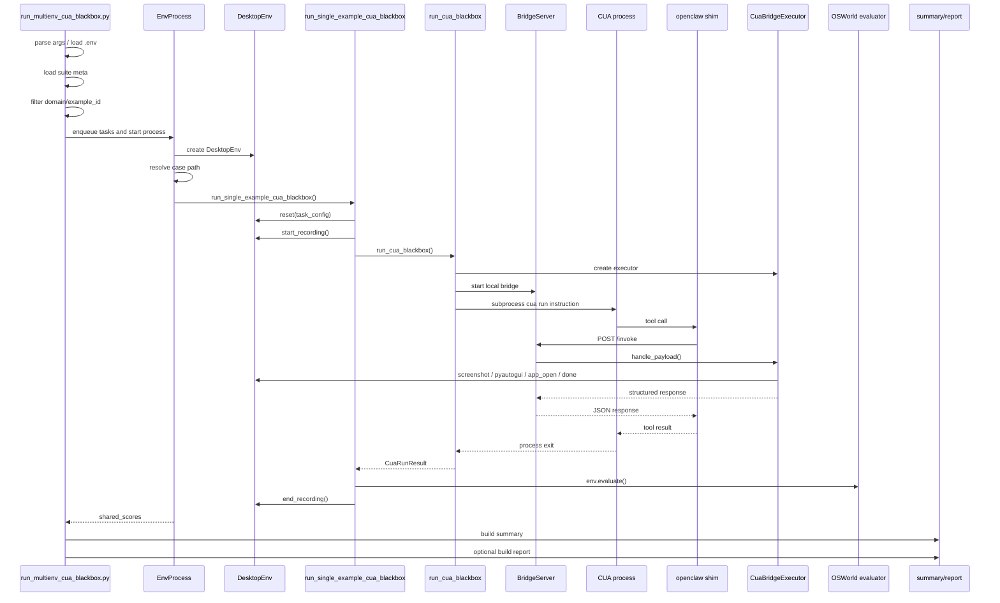

# CUA Blackbox 评测开发者指南

日期：2026-05-03

本文面向后续继续维护 CUA 评测链路的开发者，解释 `scripts/python/run_multienv_cua_blackbox.py` 背后的调用关系、时序、关键模块和扩展方式。

当前方案是 **CUA blackbox**：

- OSWorld 负责 VM、任务 reset、tool 执行、evaluator、summary 和报告。
- CUA 作为外部运行时通过 `cua run` 启动。
- CUA 不直接操作 VM，而是通过 `openclaw` shim 调 OSWorld bridge。
- 尽量不改 CUA 源码。

---

## 1. 新开发者从哪里开始

建议按这个顺序阅读：

1. `docs/cua-osworld-adapter/blackbox/README.md`
2. 本文档
3. `scripts/python/run_multienv_cua_blackbox.py`
4. `lib_run_single.run_single_example_cua_blackbox()`
5. `osworld_cua_bridge/launcher.py`
6. `osworld_cua_bridge/executor.py`
7. `osworld_cua_bridge/reporting.py`
8. `scripts/python/build_cua_blackbox_report.py`
9. `scripts/python/serve_cua_blackbox_report.py`

最小验证命令：

```bash
uv run python scripts/python/cua_smoke_test.py \
  --result_dir ./results_cua_smoke
```

真实 VM 单环境入口：

```bash
uv run python scripts/python/run_multienv_cua_blackbox.py \
  --provider_name vmware \
  --path_to_vm /path/to/Ubuntu0.vmx \
  --headless \
  --action_space pyautogui \
  --observation_type screenshot \
  --test_all_meta_path evaluation_examples/cua_blackbox/suites/regression.json \
  --model cua-blackbox-regression \
  --num_envs 1 \
  --result_dir ./results_cua_regression \
  --build_report
```

---

## 2. 入口职责

主入口：

```text
scripts/python/run_multienv_cua_blackbox.py
```

它不是 agent 逻辑，而是评测编排器，职责是：

- 读取 CLI 和 `.env` 配置。
- 加载 suite meta，例如 `evaluation_examples/cua_blackbox/suites/regression.json`。
- 筛选 `--domain` 和 `--example_id`。
- 跳过已有 `result.txt` 的已完成任务。
- 创建一个或多个 `DesktopEnv` worker。
- 每个 worker 逐个执行 OSWorld case。
- 每个 case 内启动 CUA blackbox 进程。
- 任务结束后调用 OSWorld evaluator。
- 汇总 `summary/`，可选生成 `report/`。

注意：

- 当前本地 Mac 阶段建议 `num_envs=1`。
- `num_envs>1` 必须准备多个独立 VM，不能多个 worker 竞争同一个 `.vmx`。
- 这个脚本作为 CLI 使用即可，不建议被别的代码直接 import，因为它在模块顶层会解析参数和初始化日志。

---

## 3. 主调用链

核心调用链如下：

```text
run_multienv_cua_blackbox.py
  ├─ config()
  ├─ load .env
  ├─ load test_all_meta_path
  ├─ filter_examples()
  ├─ get_unfinished()
  ├─ test()
  │   ├─ distribute_tasks()
  │   ├─ multiprocessing.Manager()
  │   ├─ start EnvProcess-N
  │   └─ run_env_tasks()
  │       ├─ DesktopEnv(...)
  │       ├─ resolve_case_path()
  │       ├─ load case json
  │       ├─ build example_result_dir
  │       └─ lib_run_single.run_single_example_cua_blackbox()
  │           ├─ env.reset(task_config=example)
  │           ├─ write run_meta.json
  │           ├─ env.controller.start_recording()
  │           ├─ osworld_cua_bridge.launcher.run_cua_blackbox()
  │           │   ├─ prepare runtime CUA config
  │           │   ├─ create CuaBridgeExecutor
  │           │   ├─ start BridgeServer
  │           │   ├─ subprocess.Popen(cua run ...)
  │           │   ├─ CUA -> openclaw -> bridge /invoke
  │           │   └─ write cua_meta.json / failure metadata
  │           ├─ sleep settle_sleep
  │           ├─ env.evaluate()
  │           ├─ write result.txt
  │           └─ env.controller.end_recording(recording.mp4)
  └─ generate_summary()
      ├─ build_blackbox_summary()
      └─ optional build_report()
```

---

## 4. 时序图



---

## 5. 关键模块关系

### 5.1 Runner 层

`scripts/python/run_multienv_cua_blackbox.py`

- 负责多任务、多进程、结果目录和 summary。
- 不处理 CUA tool 细节。
- 不处理 evaluator 细节。

相关函数：

- `config()`：定义 CLI 参数。
- `filter_examples()`：按 domain / example_id 选择任务。
- `get_unfinished()`：跳过已完成任务。
- `test()`：创建进程和任务队列。
- `run_env_tasks()`：每个 worker 持有一个 `DesktopEnv`，循环跑 case。
- `generate_summary()`：生成 `summary/` 和可选 `report/`。

### 5.2 单任务执行层

`lib_run_single.run_single_example_cua_blackbox()`

- reset VM 到 case 初始状态。
- 写 `run_meta.json`。
- 启动录屏。
- 调 `run_cua_blackbox()`。
- 等待 UI settle。
- 调 `env.evaluate()`。
- 写 `result.txt`。
- 结束录屏。

这个函数是 OSWorld case 生命周期和 CUA 运行时之间的边界。

### 5.3 CUA 进程启动层

`osworld_cua_bridge/launcher.py`

- 准备 CUA runtime config。
- 启动 `BridgeServer`。
- 拼装 `cua run` 命令。
- 注入环境变量：
  - `OSWORLD_CUA_BRIDGE_URL`
  - `OSWORLD_CUA_NODE_ID`
  - `OSWORLD_CUA_RUN_ID`
  - `CUA_CONFIG_DIR`
- 捕获 stdout / stderr。
- 记录 `cua_meta.json`。
- 把 CUA 启动失败、超时、非零退出等写成标准 failure metadata。

### 5.4 Bridge 层

`osworld_cua_bridge/server.py`

- 提供 `/health` 和 `/invoke`。
- `/invoke` 接收 openclaw shim 转发来的 CUA tool request。

`osworld_cua_bridge/executor.py`

- 校验 `runId`。
- 用 `reqId` 做幂等缓存。
- 用 lock 防止并发 tool 执行串状态。
- 分发工具：
  - `screenshot`
  - `get_screen_size`
  - `get_cursor_position`
  - `done`
  - GUI tool：转成 pyautogui / app_open / clipboard command
- 写 `bridge_requests.jsonl` 和 `bridge_screenshots/`。
- 记录 bridge failure，供 summary 使用。

`osworld_cua_bridge/tool_translator.py`

- 把 CUA tool 参数映射到屏幕坐标。
- 把工具翻译成 VM 内 `pyautogui` Python 命令。
- 新增 CUA tool 时优先看这里。

### 5.5 统计和报告层

`osworld_cua_bridge/reporting.py`

- 扫描结果目录。
- 读取 `result.txt` 和 `failure_summary.json`。
- 输出：
  - `summary/summary.json`
  - `summary/summary.csv`
  - `summary/domain_summary.json`
  - `summary/failure_summary.json`

`scripts/python/build_cua_blackbox_report.py`

- 读取 `summary/` 和可选测试报告。
- 输出：
  - `report/report.json`
  - `report/report.md`
  - `report/index.html`

`scripts/python/serve_cua_blackbox_report.py`

- 只读 Web 展示。
- 支持多个 result root。
- 支持前端过滤。
- artifact 只允许访问 `result_root` 内路径。

---

## 6. 结果目录如何读

一次 blackbox 评测的结果根目录：

```text
<result_dir>/<action_space>/<observation_type>/<model>/
```

典型结构：

```text
args.json
<domain>/<task_id>/
  run_meta.json
  runtime.log
  cua.stdout.log
  cua.stderr.log
  cua_meta.json
  bridge_requests.jsonl
  bridge_screenshots/
  traj.jsonl
  result.txt
  failure_summary.json
  recording.mp4
summary/
  summary.json
  summary.csv
  domain_summary.json
  failure_summary.json
report/
  report.json
  report.md
  index.html
```

排查优先级：

1. `report/index.html`
2. `summary/failure_summary.json`
3. 单任务 `failure_summary.json`
4. 单任务 `runtime.log`
5. `cua.stderr.log`
6. `bridge_requests.jsonl`
7. `recording.mp4`

---

## 7. 如何继续优化 CUA 评测

### 7.1 新增 CUA tool

改动路径：

- `osworld_cua_bridge/tool_translator.py`
- `osworld_cua_bridge/executor.py`
- `scripts/python/cua_bridge_vm_functional_test.py`
- `scripts/python/cua_smoke_test.py`
- `docs/cua-osworld-adapter/blackbox/NEXT_PHASE_PLAN_AND_TEST_POINTS_zh.md`

建议步骤：

1. 先明确 CUA tool 的输入参数和预期输出。
2. 在 `tool_translator.py` 增加参数标准化和 pyautogui 命令。
3. 如果不是 GUI 动作，在 `executor.py` 增加专门 handler。
4. 给本地 fake env 加 smoke。
5. 给真实 VM functional test 加 TP。
6. 用单任务 blackbox 验证。

### 7.2 新增评测 case

通用 case：

```text
evaluation_examples/examples/<domain>/<case_id>.json
```

CUA 专用 case：

```text
evaluation_examples/cua_blackbox/cases/<domain>/<case_id>.json
```

把 case 加入 suite：

```text
evaluation_examples/cua_blackbox/suites/<suite_name>.json
```

验证：

```bash
uv run python scripts/python/validate_cua_regression_cases.py \
  --meta_path evaluation_examples/cua_blackbox/suites/<suite_name>.json
```

CUA 专用 case 示例：

```text
evaluation_examples/cua_blackbox/cases/chrome/cua-demo-open-downloads.json
evaluation_examples/cua_blackbox/suites/demo_custom_case.json
```

### 7.3 优化失败分类

改动路径：

- `osworld_cua_bridge/failures.py`
- `osworld_cua_bridge/executor.py`
- `osworld_cua_bridge/launcher.py`
- `osworld_cua_bridge/reporting.py`

原则：

- 能自动归类的失败不要只写 `unknown_error`。
- failure type 要稳定，便于跨版本统计。
- failure reason 可以详细，但不要放敏感配置内容。

### 7.4 优化报告

改动路径：

- `scripts/python/build_cua_blackbox_report.py`
- `scripts/python/serve_cua_blackbox_report.py`

常见方向：

- 增加更细的 failure drill-down。
- 增加 task 级日志链接。
- 增加截图/录屏预览。
- 增加多次评测对比。
- 增加 CUA 版本、config hash、binary hash 展示。

### 7.5 CUA 版本升级回归

建议固定流程：

```bash
uv run python scripts/python/check_cua_blackbox_compatibility.py
uv run python scripts/python/cua_smoke_test.py --result_dir ./results_cua_smoke
uv run python scripts/python/cua_bridge_vm_functional_test.py --tools screenshot,get_screen_size,get_cursor_position
uv run python scripts/python/run_multienv_cua_blackbox.py \
  --test_all_meta_path evaluation_examples/cua_blackbox/suites/regression.json \
  --num_envs 1 \
  --build_report
```

如果 CUA CLI 参数变化，先改：

- `osworld_cua_bridge/launcher.py`
- `scripts/python/check_cua_blackbox_compatibility.py`

---

## 8. 修改前必须注意的边界

- 不要把 CUA 源码改成 OSWorld 专用版本。
- 不要复制已有 OSWorld case 到 `evaluation_examples/cua_blackbox/cases/`。
- 不要在 runner 里写 evaluator 逻辑。
- 不要让多个 worker 共享同一个 VM。
- 不要把 `.env`、本机绝对私密路径、密钥写进提交。
- Web report server 必须保持只读。

---

## 9. 常用开发命令

本地 smoke：

```bash
uv run python scripts/python/cua_smoke_test.py \
  --result_dir ./results_cua_smoke
```

静态 case 校验：

```bash
uv run python scripts/python/validate_cua_regression_cases.py
```

CUA 专用 demo case 校验：

```bash
uv run python scripts/python/validate_cua_regression_cases.py \
  --meta_path evaluation_examples/cua_blackbox/suites/demo_custom_case.json
```

兼容性检查：

```bash
uv run python scripts/python/check_cua_blackbox_compatibility.py
```

重建 summary 和 report：

```bash
uv run python scripts/python/build_cua_blackbox_summary.py \
  --result_root <result-root> \
  --build_report
```

启动 Web report：

```bash
uv run python scripts/python/serve_cua_blackbox_report.py \
  --result_root <result-root> \
  --open_browser
```

---

## 10. 一句话理解

`run_multienv_cua_blackbox.py` 负责“把 OSWorld case 排队、交给 VM worker、跑完后汇总”；`lib_run_single.run_single_example_cua_blackbox()` 负责“单个 case 的 reset、CUA 运行、evaluate、录屏”；`osworld_cua_bridge/` 负责“让 CUA 通过 openclaw 安全地调用 OSWorld 的 VM 工具”；`reporting.py` 和报告脚本负责“把结果变成可验收、可展示、可回归的数据”。
