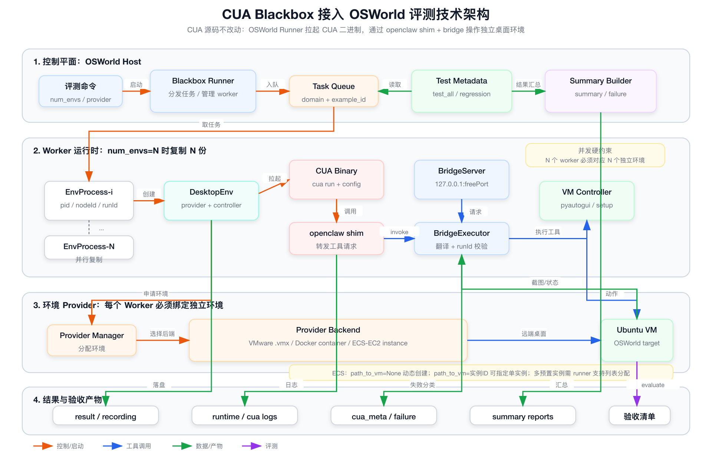

# CUA Blackbox 技术架构图

日期：2026-05-02

## 1. 架构图

源文件：

- [SVG](./assets/cua_blackbox_architecture.svg)
- [PNG](./assets/cua_blackbox_architecture.png)

## 2. 核心链路

当前方案的核心边界是：不修改 `CUA` 源码，把 `CUA` 当成黑盒二进制由 OSWorld runner 拉起。

执行链路：

1. `Blackbox Runner` 读取仓库根目录 `.env` 中的 CUA 默认参数，再读取 `test_all` 或回归集合，把任务放入队列。
2. `num_envs=N` 时启动 N 个 `EnvProcess`。
3. 每个 `EnvProcess` 创建一个 `DesktopEnv`，并通过 provider 绑定一个独立桌面环境。
4. 每个任务启动一个 `CUA Binary`，并把 `OSWORLD_CUA_BRIDGE_URL`、`OSWORLD_CUA_RUN_ID`、`OSWORLD_CUA_NODE_ID` 注入到 CUA 子进程环境变量。
5. CUA 调用 `openclaw shim`，shim 把工具请求转发给本机 `BridgeServer`。
6. `BridgeExecutor` 校验 `runId`，把 CUA 工具请求翻译成 OSWorld controller 动作。
7. OSWorld controller 操作目标 Ubuntu 桌面，任务结束后执行 `env.evaluate()`。
8. 结果写入标准 OSWorld 结果目录，并生成 `summary` / `failure` 汇总。

CUA 路径、配置文件、版本标签和 timeout 默认值走 `.env`；命令行显式传入的参数优先级更高。这样本仓库不需要硬编码任何本机 CUA 路径，也不需要修改 `CUA` 源码。

## 3. 并发硬约束

OSWorld 的并发不是多个任务共用一个桌面，而是多个 worker 各自持有独立桌面环境。

因此 `num_envs=N` 成立的必要条件是：

- N 个独立 worker 进程。
- N 个独立 VM、container 或 ECS/EC2 实例。
- N 组互不冲突的 controller 连接信息。
- N 组互不冲突的 CUA `nodeId`、`runId`、`runsDir`、bridge port 和结果目录。

如果多个 worker 共享同一个 `.vmx`、同一个 container 或同一个云实例，并发验证没有意义，通常会在 provider 启动、controller 连接或任务状态隔离阶段失败。

## 4. ECS / EC2 指定实例方案

可以提前准备 ECS/EC2 实例，然后指定给 OSWorld 使用，但要分清当前代码已经支持什么、还缺什么。

当前已支持：

- `provider_name=aws` 时，如果不传 `path_to_vm`，`AWSVMManager.get_vm_path()` 会按 AMI 动态创建新实例。
- `provider_name=aws` 时，如果传 `path_to_vm=i-xxx`，`AWSProvider.start_emulator()` 会把它当成已有 EC2 instance id 去启动和连接。
- `provider_name=azure` 时，`path_to_vm` 使用 `resource_group/vm_name` 形式指定已有 VM。

如果这里的 ECS 指的是阿里云 ECS：

- 底层 `desktop_env.providers.aliyun` 已有 provider，`path_to_vm` 语义是 ECS instance id。
- 但当前 `run_multienv_cua_blackbox.py` 的 `--provider_name` choices 尚未放开 `aliyun`，需要先在 OSWorld 侧补 CLI 支持和配置校验。

当前不完整支持：

- `run_multienv_cua_blackbox.py` 当前只有一个 `--path_to_vm` 参数。
- 如果 `num_envs>1` 同时指定一个实例 ID，所有 worker 会竞争同一个实例，这不满足并发隔离。
- 当前没有 `--path_to_vm_list` 或 `--path_to_vm_file`，还不能把多个预置实例稳定分配给不同 worker。

还要注意 reset 语义：

- AWS provider 的 `revert_to_snapshot()` 会基于 AMI 创建新实例，并终止旧实例。
- 如果把“提前准备好的实例”当作长期固定资源池使用，需要明确是否允许 OSWorld 在 reset 时终止并重建它。
- 如果不允许终止预置实例，需要额外设计“预置实例池 + 非破坏式 reset”或“一任务一实例，用完销毁”的策略。

## 5. 推荐落地策略

短期并行验证建议：

- 本地 VMware：准备多个独立 `.vmx`，并给 runner 增加 `--path_to_vm_list`，每个 worker 固定绑定一个 VM。
- 云上 ECS/EC2：优先用动态创建模式，即不传 `--path_to_vm`，让 provider 为每个 worker 创建独立实例。

如果必须使用提前准备好的 ECS/EC2 实例池，建议新增：

- `--path_to_vm_list`：逗号分隔实例 ID。
- 或 `--path_to_vm_file`：每行一个实例 ID。
- worker 启动时按 `worker_index` 取对应实例。
- 启动前校验实例数量必须大于等于 `num_envs`。
- 文档中明确 reset 是否会销毁或替换实例。

这个改动仍然只发生在 OSWorld 侧，不需要修改 `CUA` 源码。
