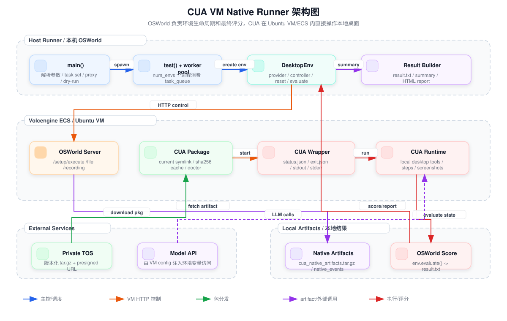
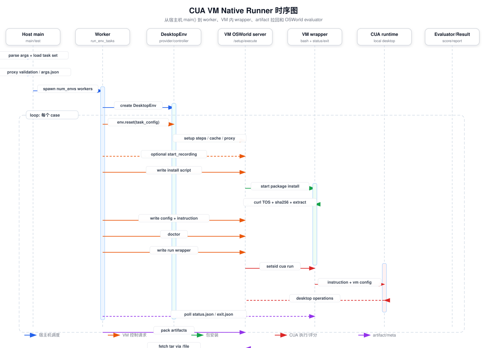

# CUA VM Native Runner 调用链与时序

最后更新：2026-05-28

本文解释执行下面命令后，代码如何从 `scripts/python/run_multienv_cua_vm_native.py` 一路调用到 VM 内 CUA、OSWorld evaluator 和结果报告。

```bash
uv run python "scripts/python/run_multienv_cua_vm_native.py" ...
```

这份文档只讲 VM native runner。旧 blackbox runner 和 `osworld_cua_bridge/` 不在这条主链路里。

## 图示

架构图源文件：[assets/vm-native-architecture.svg](assets/vm-native-architecture.svg)，PNG：[assets/vm-native-architecture.png](assets/vm-native-architecture.png)。



时序图源文件：[assets/vm-native-sequence.svg](assets/vm-native-sequence.svg)，PNG：[assets/vm-native-sequence.png](assets/vm-native-sequence.png)。



## 入口结论

主调用链可以压缩成：

```text
main()
  -> config()
  -> setup_logging()
  -> 读取 test_all_meta_path
  -> filter_examples()
  -> apply_task_proxy_policy()
  -> 写 args.json
  -> dry_run() 或 validate_task_proxy_config_if_needed()
  -> get_unfinished()
  -> test()
      -> prewarm_volcengine_pool()
      -> 启动 num_envs 个 multiprocessing.Process
      -> 每个 worker 执行 run_env_tasks()
          -> _run_env_tasks()
              -> DesktopEnv(...)
              -> 循环从 task_queue 取 case
              -> run_single_example_cua_vm_native()
                  -> env.reset(task_config)
                  -> start_recording()
                  -> run_cua_vm_native()
                      -> 解析/下载/安装 CUA 包
                      -> 生成 VM native config
                      -> 写 instruction/config 到 VM
                      -> doctor
                      -> 后台启动 VM 内 CUA wrapper
                      -> 轮询 exit.json/status.json
                      -> 清理临时脚本
                      -> 打包并拉回 artifact
                      -> 写 cua_meta.json/failure.json/native_events.jsonl
                  -> settle_sleep
                  -> env.evaluate()
                  -> 写 result.txt
                  -> end_recording()
              -> env.close()
  -> generate_summary()
      -> build_blackbox_summary()
      -> 可选 build_report()
```

## 主进程阶段

### 1. 参数解析

入口在 `scripts/python/run_multienv_cua_vm_native.py`：

```text
if __name__ == "__main__":
    main()
```

`main()` 第一件事是：

```text
args = config()
```

`config()` 做三类事情：

- 定义 OSWorld 参数：`--provider_name`、`--os_type`、`--test_all_meta_path`、`--domain`、`--example_id`、`--num_envs`。
- 定义 CUA 参数：`--cua_config_path`、`--cua_max_duration_ms`、`--cua_max_step_duration_ms`、`--vm_cua_*`。
- 从 `.env` / 环境变量填默认值，例如 `OSWORLD_CUA_VM_PACKAGE_TOS_BUCKET`、`OSWORLD_CUA_VM_PACKAGE_SHA256`、`VOLCENGINE_*`。

`load_repo_dotenv(ROOT_DIR)` 在模块 import 阶段执行，所以 `.env` 会先被加载，再解析参数。

### 2. 日志初始化

`setup_logging(args)` 写两个日志文件：

- `logs/vm-native-normal-<timestamp>.log`
- `logs/vm-native-debug-<timestamp>.log`

同时也把日志输出到 stdout。worker 进程里会通过 `ensure_worker_logging(args)` 重新挂载同一套日志 handler。

### 3. 选择任务集

`main()` 读取：

```text
args.test_all_meta_path
```

然后调用：

```text
selected_task_set = filter_examples(test_all_meta, args.domain, args.example_id)
```

规则是：

- `--domain all`：保留全部 domain。
- `--domain chrome`：只保留指定 domain。
- `--example_id xxx`：只保留指定 case。

之后 `apply_task_proxy_policy(args, selected_task_set)` 会检查选中的 case 是否有 `proxy=true`。如果选中任务需要代理，但用户传了 `--disable_task_proxy`，且 provider 支持 task proxy，runner 会强制启用代理并要求有效 `PROXY_CONFIG_FILE`。

### 4. dry-run 分支

如果传了 `--dry_run`：

```text
dry_run(args, selected_task_set)
```

它只解析 case 路径、统计任务数，不启动 VM，不创建 ECS，不跑 CUA。

### 5. 正式运行前检查

非 dry-run 时先执行：

```text
validate_task_proxy_config_if_needed(args)
```

如果选中任务里有 `proxy=true` 且代理启用，这里会读取 `PROXY_CONFIG_FILE`，并拒绝占位账号/密码。

然后：

```text
test_file_list = get_unfinished(args, copy.deepcopy(selected_task_set))
```

如果结果目录里某个 case 已经有 `result.txt`，它会被跳过，避免重复跑。

## 并发调度阶段

正式执行入口是：

```text
test(args, test_file_list)
```

### 1. Volcengine pool

如果满足：

```text
provider_name == "volcengine"
path_to_vm 为空
VOLCENGINE_POOL_ENABLED=1
```

`test()` 会进入 `exclusive_pool_run(reset_registry=True)`，然后调用：

```text
prewarm_volcengine_pool(args)
```

它会根据 `VOLCENGINE_POOL_SIZE` 和 `args.num_envs` 预热 ECS pool。

### 2. 任务队列和 worker

`test()` 用 `multiprocessing.Manager()` 建立：

- `shared_scores`：跨进程收集分数。
- `task_queue`：所有 `(domain, example_id)`。

然后启动 `args.num_envs` 个进程：

```text
Process(target=run_env_tasks, args=(task_queue, args, shared_scores))
```

每个 worker 都是一个独立 OSWorld environment，循环从同一个队列取任务。这个设计的含义是：

- `num_envs=28` 不是一个进程跑 28 个 case，而是 28 个 worker 并发消费队列。
- 每个 worker 里复用一个 `DesktopEnv`，多个 case 会顺序跑在同一个 worker 的 VM/ECS 上。
- 每个 case 开始前会 `env.reset(task_config)`，保证任务环境回到正确状态。

## Worker 阶段

worker 入口：

```text
run_env_tasks()
  -> _run_env_tasks()
```

`run_env_tasks()` 只负责 worker 日志和 Volcengine pool lock。真正逻辑在 `_run_env_tasks()`。

### 1. 创建 DesktopEnv

`_run_env_tasks()` 创建：

```text
env = DesktopEnv(
    action_space="pyautogui",
    provider_name=args.provider_name,
    snapshot_name=_snapshot_name(args),
    screen_size=(args.screen_width, args.screen_height),
    os_type=args.os_type,
    enable_proxy=proxy_enabled,
)
```

`DesktopEnv.__init__()` 会：

- 调用 `create_vm_manager_and_provider()` 创建 provider/manager。
- 通过 provider 启动 VM/ECS。
- 获取 VM IP。
- 创建 `PythonController` 和 `SetupController`。

`PythonController` 是后续 HTTP 调用 VM 内 OSWorld server 的入口，例如：

- `/setup/execute`
- `/file`
- `/start_recording`
- `/end_recording`

### 2. 循环取 case

worker 从 `task_queue` 取 `(domain, example_id)` 后：

```text
config_file = resolve_case_path(...)
example = json.load(config_file)
example_result_dir = result_dir/action_space/observation_type/model/domain/example_id
```

然后进入单 case 主函数：

```text
run_single_example_cua_vm_native(env, example, args, example_result_dir, shared_scores, proxy_enabled)
```

## 单 case 阶段

`run_single_example_cua_vm_native()` 是 OSWorld 外层单任务时序。

### 1. 写 run_meta

先写：

```text
run_meta.json
```

里面记录：

- `execution_mode=vm_native`
- `bridge_enabled=false`
- proxy 是否需要/启用
- package version / sha256
- model、screen size、task set

### 2. OSWorld reset/setup

调用：

```text
env.reset(task_config=example)
```

`DesktopEnv.reset()` 会：

- 判断是否需要 revert snapshot。
- 如需 proxy，调用 `SetupController._proxy_setup()`。
- 调用 `_set_task_info(task_config)`，保存 instruction、setup config、evaluator。
- 调用 `setup_controller.reset_cache_dir()`。
- 调用 `setup_controller.setup(self.config, proxy_enabled)` 执行 case 的 setup steps。
- 返回初始 observation。

注意：VM native 模式下，CUA 不使用 `env.step()` 操作桌面。CUA 在 VM 里自己操作桌面；OSWorld 只负责 reset/setup 和最后 evaluate。

### 3. 启动录屏

如果没有 `--disable_recording`：

```text
env.controller.start_recording()
```

它通过 VM 内 OSWorld server 的 `/start_recording` 启动 ffmpeg。结束时会用 `/end_recording` 拉回 `recording.mp4`。

### 4. 启动 CUA VM native

核心调用：

```text
native_result = run_cua_vm_native(
    env=env,
    example=example,
    instruction=example["instruction"],
    args=args,
    example_result_dir=example_result_dir,
)
```

这里会把 OSWorld 的 `example["instruction"]` 原样传给 CUA。

## VM Native Launcher 阶段

`run_cua_vm_native()` 在 `osworld_cua_vm_native/launcher.py` 中。它负责把 CUA 包、config、instruction、wrapper 脚本写进 VM，并把 CUA 跑完后的证据拉回来。

### 1. run_id 和远端路径

先生成：

```text
run_id = <example_id>-<utc_timestamp>-<host_pid>
```

远端默认目录：

```text
/home/user/.local/share/osworld-cua-runs/<run_id>/
```

关键路径：

- `instruction.txt`
- `config.vm-native.redacted.json`
- `run_cua_once.sh`
- `install_cua_package.sh`
- `cua/`
- `status.json`
- `exit.json`
- `native_events.jsonl`
- `<run_id>.artifacts.tar.gz`

### 2. 解析 CUA 包 URL

如果配置了 CUA 包分发，先走：

```text
resolve_package_url(args)
```

优先级：

```text
--vm_cua_package_url_refresh_cmd / OSWORLD_CUA_VM_PACKAGE_URL_REFRESH_CMD
> --vm_cua_package_url / OSWORLD_CUA_VM_PACKAGE_URL
> TOS bucket + key + tosutil presign
```

正式私有 TOS 方案通常走第三种：runner 本机生成短期 presigned URL，ECS 只拿 URL 下载，不保存 TOS AK/SK。

### 3. VM 内安装 CUA 包

如果需要包安装：

```text
install_script = build_install_script(...)
install_exit = run_remote_job(...)
```

`run_remote_job()` 的固定套路是：

```text
write_remote_text(controller, script_path, script)
start_remote_script(controller, script_path)
wait_for_exit_json(controller, exit_path, status_path)
```

这些操作都通过 VM 内 server 的 `/setup/execute` 完成。

安装脚本在 VM 内执行：

- 可选随机 jitter，缓解 28 并发下载突刺。
- 如果 `current/.cua-package-sha256` 命中，直接 `already_installed`。
- 否则用 `curl` 下载 presigned URL。
- 校验 sha256。
- 解压 tar.gz。
- 检查 `cua-linux-x64-pkg/cua-linux-x64.sh` 是否可执行。
- 切换 `current` symlink。

安装阶段失败会写：

- `cua_package_meta.json`
- `failure.json`
- `native_events.jsonl`

### 4. 准备 VM native config

加载本地 config：

```text
source_config = load_source_config(args)
```

默认来自：

```text
${OSWORLD_CUA_ROOT:-$CUA_ROOT}/config/local.json
```

然后：

```text
vm_config, env_vars, redacted_config = prepare_vm_config(...)
```

它会做三件关键事：

- 把本地模型 API key 改成环境变量引用，例如 `${CUA_MODEL_API_KEY}`。
- 把真实 key 放进 `env_vars`，只注入 CUA 进程环境。
- 写入 `agent.runsDir` 和 `agent.benchmarkProfile=osworld`。

接着用 `/setup/execute` 写入 VM：

- VM 内真实 config：`/home/user/.config/osworld-cua/vm-native.json`
- VM 内 instruction：`instruction.txt`
- 脱敏 config：`config.vm-native.redacted.json`

本地结果目录也会保存一份脱敏的 `config.vm-native.redacted.json`。

### 5. doctor 检查

如果没有传 `--vm_cua_skip_doctor`：

```text
<cua_bin> doctor --checks binaries --strict
```

执行方式是：

```text
run_vm_shell(env.controller, command)
```

doctor 结果写到：

```text
doctor.json
```

doctor 非 0 会写 `failure.json`，并跳过 CUA run。

### 6. VM 内执行 CUA

如果前置条件都满足：

```text
run_script = build_cua_run_script(...)
exit_state = run_remote_job(...)
```

`build_cua_run_script()` 生成的 VM 内命令核心是：

```text
setsid <cua_bin> run "<instruction>" \
  --config "<vm_config_path>" \
  --runs-dir "<cua_runs_dir>" \
  --max-steps <max_steps> \
  --max-duration-ms <cua_max_duration_ms> \
  --max-step-duration-ms <cua_max_step_duration_ms>
```

同时注入：

- `DISPLAY`
- `XAUTHORITY`
- 模型 API key 环境变量
- `CUA_BENCHMARK_PROFILE=osworld`
- `OSWORLD_CUA_BENCHMARK=1`

wrapper 会维护：

- `status.json`：当前进程 pid/pgid、stage、started_at。
- `exit.json`：完成状态、exit_code、timed_out、duration。
- `stdout.log` / `stderr.log`
- `native_events.jsonl`

timeout 是两层：

- CUA 内部 timeout：`--max-duration-ms` / `--max-step-duration-ms`，由 CUA 自己处理并落 artifact。
- runner 外层 timeout：`--vm_cua_run_timeout_seconds`，wrapper 超时后会 `SIGTERM`，再按 grace `SIGKILL` 进程组。

### 7. 进程清理

CUA run 结束后，launcher 会删除 VM 内临时脚本：

```text
rm -f run_cua_once.sh install_cua_package.sh
```

这些脚本可能含 presigned URL 或环境变量，所以不会进入 artifact。

### 8. artifact 打包和拉回

launcher 生成 pack script：

```text
tar -czf <run_id>.artifacts.tar.gz -C <remote_run_dir> .
```

显式排除：

- `run_cua_once.sh`
- `install_cua_package.sh`
- `artifacts.tar.gz`

然后：

```text
archive_bytes = env.controller.get_file(remote_archive)
```

`PythonController.get_file()` 调 VM 内 server 的 `/file`，把远端 tar 包拉回本地：

```text
cua_native_artifacts.tar.gz
```

本地再解包到：

```text
_vm_native_run/
```

并通过 `materialize_remote_run_artifacts()` 整理为更方便读的文件：

- `cua.stdout.log`
- `cua.stderr.log`
- `native_events.jsonl`
- `status.json`
- `exit.json`
- `cua_native_runs/`
- `config.vm-native.redacted.json`

### 9. 写 CUA metadata

最后写：

```text
cua_meta.json
```

包含：

- `run_id`
- `remote_run_dir`
- `exit_state`
- `package`
- `cua_bin`
- `vm_cua_config_path`
- `artifact_archive`
- `artifact_copy`
- `failure_type`
- `failure_reason`

如果 artifact 中显示 CUA 自己 `success=false`，但进程 exit code 是 0，launcher 也会写 `failure_type=cua_run_failed`。这表示“CUA 任务级失败”，不一定是 OSWorld evaluator 失败。

## Evaluate 和打分阶段

`run_cua_vm_native()` 返回后，`run_single_example_cua_vm_native()` 继续：

```text
time.sleep(args.settle_sleep)
result = env.evaluate()
```

`DesktopEnv.evaluate()` 会：

- 执行 evaluator `postconfig`。
- 按 task JSON 里的 evaluator 配置选择 getter 和 metric。
- getter 从 VM 当前状态取结果，例如文件内容、目录、浏览器页面、应用配置。
- metric 计算分数。

OSWorld 分数以 `env.evaluate()` 为准。CUA 的 `success=false`、`cua_run_failed`、`cua_run_timeout` 是 runtime 诊断，不直接等于 OSWorld 分数。

只有下面这类前置工程失败会把 evaluator 原始分强制调成 0：

- CUA 包 URL 缺失。
- CUA 包下载失败。
- sha256 不匹配。
- 解压失败。
- 入口不存在。
- doctor 失败。
- CUA config 写入失败。
- 未知工程失败。

正常 CUA 策略失败或低分不会被 runner 强行改分。

最后写：

- `result.txt`
- 可选 `raw_result.txt`
- 更新 `run_meta.json`
- 更新 `cua_meta.json`
- `log_task_completion(...)`

## 录屏结束和环境释放

`run_single_example_cua_vm_native()` 的 `finally` 里会结束录屏：

```text
env.controller.end_recording("recording.mp4")
```

worker 的 `finally` 里会：

```text
env.close()
```

`DesktopEnv.close()` 调 provider 停止或释放 VM/ECS。

## Summary 和 Report 阶段

所有 worker 结束后，主进程继续：

```text
generate_summary(args, selected_task_set)
```

它复用 blackbox report 的 summary/report 工具，但 metadata 会标记：

```json
{
  "execution_mode": "vm_native",
  "bridge_enabled": false
}
```

如果传了 `--build_report`，还会生成 HTML report。

## 时序图

```text
Host main process
  |
  | parse args / load task set / validate proxy
  | create task_queue
  | spawn num_envs workers
  v
Worker process
  |
  | DesktopEnv(provider=volcengine, action_space=pyautogui)
  | get one case from queue
  v
OSWorld VM/ECS
  |
  | env.reset(task_config)
  | setup_controller.setup(case config)
  | optional start_recording
  v
VM native launcher on host
  |
  | resolve package URL
  | POST /setup/execute: write install script
  | POST /setup/execute: start install script
  | poll status.json / exit.json
  | POST /setup/execute: write vm-native config + instruction
  | POST /setup/execute: doctor
  | POST /setup/execute: write run wrapper
  | POST /setup/execute: start run wrapper
  | poll status.json / exit.json
  v
CUA inside VM
  |
  | cua-linux-x64.sh run "<instruction>"
  | uses local desktop tools directly
  | writes CUA run artifacts
  v
VM native launcher on host
  |
  | POST /setup/execute: pack artifacts
  | POST /file: fetch cua_native_artifacts.tar.gz
  | materialize artifacts locally
  v
OSWorld evaluator
  |
  | settle_sleep
  | env.evaluate()
  | write result.txt
  | optional end_recording -> recording.mp4
  v
Summary/report
```

## 关键输出文件

每个 case 目录大致是：

```text
<result_dir>/vm_native/screenshot/<model>/<domain>/<example_id>/
  result.txt
  run_meta.json
  cua_meta.json
  cua_package_meta.json
  failure.json
  doctor.json
  config.vm-native.redacted.json
  native_events.jsonl
  cua.stdout.log
  cua.stderr.log
  cua_native_artifacts.tar.gz
  _vm_native_run/
  cua_native_runs/
  recording.mp4
```

其中最重要的排查顺序是：

1. `result.txt`：OSWorld evaluator 分数。
2. `failure.json`：runner 记录的主失败类型。
3. `cua_meta.json`：CUA run 进程状态、artifact 拉回情况。
4. `native_events.jsonl`：package、doctor、run、artifact 的阶段时序。
5. `cua.stdout.log` / `cua.stderr.log`：CUA 进程日志。
6. `cua_native_runs/`：CUA 自己的 steps、截图、runtimeFailure 等证据。
7. `recording.mp4`：桌面实际变化。

## 读代码建议

按下面顺序读，别从文件开头硬啃到结尾：

1. `scripts/python/run_multienv_cua_vm_native.py::main`
2. `scripts/python/run_multienv_cua_vm_native.py::test`
3. `scripts/python/run_multienv_cua_vm_native.py::_run_env_tasks`
4. `scripts/python/run_multienv_cua_vm_native.py::run_single_example_cua_vm_native`
5. `osworld_cua_vm_native/launcher.py::run_cua_vm_native`
6. `osworld_cua_vm_native/launcher.py::build_install_script`
7. `osworld_cua_vm_native/launcher.py::build_cua_run_script`
8. `desktop_env/desktop_env.py::reset`
9. `desktop_env/desktop_env.py::evaluate`

这条路径就是实际运行时的主干。其他 helper 主要是参数、日志、failure metadata 和 artifact 整理。
