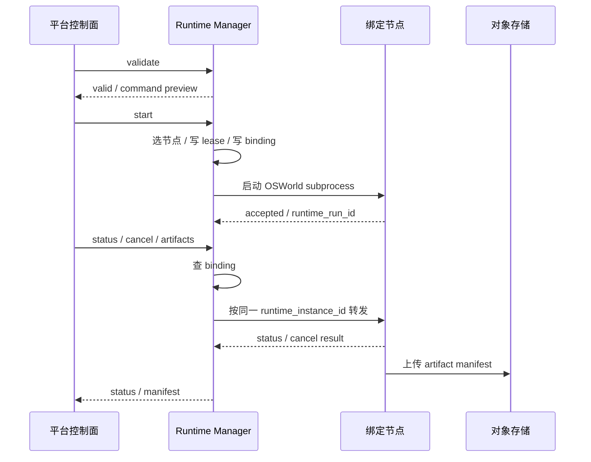

# 接口契约与最小时序

## 先定结论

- `validate / start / status / cancel / artifacts` 就是 OSWorld Runtime 的全部外部语义。
- `artifact_storage_mode` 默认 `tos`，`local_path` 只用于本地 smoke / 调试，不进入平台 ingest。
- 默认上传策略是 case 级异步上传：case 结束后立即入队，run 结束时 flush 队列并生成最终 manifest。
- `runtime_run_id` 识别一次运行，`runtime_instance_id` 识别承载节点，`lease_id` 识别资源占用。
- `status / cancel / artifacts` 必须先查 `runtime_run_bindings` 再路由到绑定节点，不得经过共享域名的随机分发。
- DB 是真相源，Redis 只做缓存或队列加速。

## 表的职责

| 表 | 作用 | 主要写入方 | 主要读取方 |
| --- | --- | --- | --- |
| `runtime_instances` | 节点注册、健康状态、容量快照 | Runtime Manager | Runtime Manager、平台控制面 |
| `runtime_tasks` | 一次 run 的任务影子记录 | Runtime Manager | 平台控制面、Runtime Manager |
| `runtime_run_bindings` | run 到节点的粘性绑定 | Runtime Manager | Runtime Manager、status/cancel/artifacts 路由 |
| `resource_leases` | 资源占用和回收 | Runtime Manager / 资源控制器 | Runtime Manager、回收任务 |

## `bootstrap_snapshot`

统一结构如下：

```json
{
  "bootstrap_mode": "tos",
  "cua_distribution": {
    "bundle_ref": {
      "storage_type": "tos",
      "bucket": "xua-cua-release",
      "object_key": "cua/releases/cua-linux-x64-pkg-<git-sha>-<timestamp>.tar.gz",
      "tos_uri": "tos://xua-cua-release/cua/releases/cua-linux-x64-pkg-<git-sha>-<timestamp>.tar.gz",
      "version": "cua-linux-x64-pkg-<git-sha>-<timestamp>",
      "sha256": "sha256:..."
    },
    "config_ref": {
      "storage_type": "tos",
      "bucket": "xua-cua-config",
      "object_key": "cua/configs/blackbox-runtime-template-<version>.json",
      "tos_uri": "tos://xua-cua-config/cua/configs/blackbox-runtime-template-<version>.json",
      "version": "blackbox-runtime-template-<version>",
      "sha256": "sha256:..."
    }
  }
}
```

规则：

- `bundle_ref` 是本次执行实际使用的 CUA 可执行包对象，不是下载凭证。
- `config_ref` 是本次执行实际使用的配置模板对象；如果配置不走 TOS，可以为空，但 `bootstrap_mode` 仍要记录来源模式。
- `storage_type=tos` 时，`bundle_ref` / `config_ref` 必须显式带 `tos_uri`，格式为 `tos://bucket/object_key`；这只是定位串，不是凭证。
- `bootstrap_snapshot` 只记录对象身份，不记录 presigned URL、AK/SK 或本机路径。

## 建议状态枚举

### `runtime_instances.status`

- `registering`
- `healthy`
- `degraded`
- `unreachable`
- `retired`

### `resource_leases.lease_status`

- `leased`
- `renewing`
- `released`
- `expired`
- `reclaimed`

### `runtime_run_bindings.binding_status`

- `pending`
- `bound`
- `releasing`
- `released`
- `lost`

### `runtime_tasks.status`

- `created`
- `submitted`
- `accepted`
- `queued`
- `running`
- `completed`
- `failed`
- `canceling`
- `canceled`

## 字段细化

### `runtime_instances`

- `id`：主键，用于内部关联，不对外暴露。
- `runtime_profile_id`：所属 RuntimeProfile，决定实例服务的 runtime_type。
- `runtime_type`：实例类型，第一阶段固定为 `osworld`。
- `instance_key`：稳定身份，不等于 IP，后续路由和审计都应围绕它。
- `base_url`：当前对外调用入口快照。
- `health_url`：健康检查入口，可独立于 `base_url`。
- `resource_profile_id`：该实例承载的资源池引用。
- `labels`：调度标签，供容量筛选和故障定位使用。
- `status`：节点健康状态。
- `status_reason`：状态变化原因。
- `last_heartbeat_at`：最近心跳时间。
- `heartbeat_ttl_seconds`：失联判定阈值快照。
- `last_capacity_payload`：最近一次容量响应快照，至少保留 `free`、`leased`、`orphan_leases`、`allow_create`、`lock_backend.type`、`lock_backend.shareable_across_instances`。
- `lock_backend`：容量后端摘要，至少保留 `type` 和 `shareable_across_instances`。
- `bootstrap_snapshot`：这台实例当前实际拉起时使用的 CUA bundle/config 对象快照。
- `last_capacity_at`：最近一次容量拉取时间。
- `metadata`：扩展信息。
- `created_at`：创建时间。
- `updated_at`：更新时间。

### `runtime_tasks`

- `id`：主键。
- `run_id`：所属 EvaluationRun。
- `runtime_profile_id`：调用的 RuntimeProfile。
- `runtime_type`：Runtime 类型，例如 `osworld`。
- `runtime_mode`：执行模式，例如 `blackbox` / `vm_native`。
- `runtime_endpoint`：当次提交入口快照。
- `runtime_instance_id`：最终绑定实例快照。
- `resource_profile_id`：资源池引用。
- `runtime_run_id`：Runtime 侧运行标识。
- `status`：任务当前状态。
- `status_reason`：状态变化原因。
- `attempt`：提交尝试号，从 1 开始。
- `idempotency_key`：提交幂等键。
- `request_payload`：validate / start 请求快照。
- `response_payload`：validate / start 响应快照。
- `last_status_payload`：最近一次 status 轮询快照。
- `bootstrap_snapshot`：这次任务实际拉取的 CUA bundle/config 对象快照。
- `error_code`：归一化错误码。
- `error_message`：脱敏后的错误信息。
- `last_polled_at`：最近轮询时间。
- `cancel_requested_at`：第一次发起取消的时间。
- `created_at`：创建时间。
- `submitted_at`：真正提交到 Runtime 的时间。
- `accepted_at`：Runtime 接受任务的时间。
- `started_at`：Runtime 开始执行的时间。
- `finished_at`：任务终态时间。
- `updated_at`：更新时间。

### `runtime_run_bindings`

- `id`：主键。
- `runtime_task_id`：对应的 RuntimeTask。
- `runtime_type`：Runtime 类型。
- `runtime_profile_id`：绑定时使用的 RuntimeProfile。
- `runtime_run_id`：运行身份。
- `runtime_instance_id`：绑定到的实例。
- `resource_profile_id`：绑定到的资源池引用。
- `lease_id`：关联的资源租约标识。
- `base_url_snapshot`：绑定时地址快照。
- `bootstrap_snapshot`：绑定时对应的 CUA bundle/config 对象快照。
- `binding_status`：绑定状态。
- `binding_reason`：绑定变化原因。
- `created_at`：创建时间。
- `released_at`：释放时间。
- `metadata`：扩展信息。

### `resource_leases`

- `id`：主键。
- `runtime_type`：资源所属 Runtime 类型。
- `runtime_profile_id`：资源对应的 RuntimeProfile。
- `resource_profile_id`：平台侧资源池引用。
- `resource_ref`：被占用的具体资源标识。
- `runtime_task_id`：触发该租约的 RuntimeTask。
- `lease_owner`：租约持有者标识。
- `runtime_run_id`：关联运行身份。
- `runtime_instance_id`：承载该资源的 Runtime 实例。
- `lease_status`：租约状态。
- `lease_reason`：状态变化原因。
- `bootstrap_snapshot`：这笔租约对应的 CUA bundle/config 对象快照。
- `lease_expires_at`：租约失效时间。
- `heartbeat_at`：最近一次续约或保活时间。
- `renewed_at`：最近一次成功续约时间。
- `created_at`：创建时间。
- `released_at`：释放时间。
- `version`：CAS 版本号。
- `metadata`：扩展信息。

## 约束与索引

- `runtime_instances`：`(runtime_type, instance_key)` 唯一；`status`、`last_heartbeat_at` 需要可检索。
- `runtime_tasks`：`(runtime_type, idempotency_key)` 唯一；`(runtime_type, runtime_run_id)` 唯一且允许为空；`run_id`、`status`、`runtime_run_id` 要建索引。
- `runtime_run_bindings`：`runtime_task_id` 唯一；`(runtime_type, runtime_run_id)` 唯一且允许为空；`runtime_instance_id`、`runtime_run_id`、`binding_status` 要能快速查到。
- `resource_leases`：`(resource_profile_id, resource_ref)` 在 active 状态下唯一；`resource_profile_id`、`runtime_run_id`、`runtime_instance_id`、`lease_status`、`lease_expires_at` 要可检索。

## 请求流转

### validate

只读，不写任何运行态数据。

作用：

- 校验执行模式、case 选择、资源池配置和 `artifact_storage_mode`。
- 新链路优先校验平台冻结后的 `case_snapshot`；旧链路里的 `case_selection.domain`、`case_selection.case_ids` 和 `run_options.test_all_meta_path` 只作为过渡兼容。
- OSWorld 请求中所有 case 必须满足 `framework_key=osworld`，且必须有 `domain` 和 `external_id`。
- 检查容量是否足够。
- 返回 sanitized command preview 和 `bootstrap_snapshot`。

Suite / case 快照规则见 [12 Suite / Case 快照与临时 test_all_meta_path 契约](./12-suite-case-runtime-contract_zh.md)。

### start

写入动作要一起完成，别拆成几步让状态中间悬空。

推荐顺序：

1. 选择健康节点。
2. 创建 `runtime_tasks` 记录。
3. 解析并落库本次要用的 `bootstrap_snapshot`。
4. 在同一事务里写 `resource_leases` 和 `runtime_run_bindings`。
5. 如果请求带 `case_snapshot`，生成并保存 `generated_suite.json`。
6. 启动 OSWorld subprocess，命令中使用 `--test_all_meta_path <generated_suite.json>`。
7. 把 `runtime_run_id`、`base_url_snapshot`、`lease_id` 落库。
8. 根据 `artifact_storage_mode` 选择对象存储上传或本地落盘。

### status

1. 先查 `runtime_run_bindings`。
2. 再查 `runtime_instances` 的最新地址和心跳。
3. 用绑定节点的 `base_url` 查询状态。
4. 如果节点不可达，返回 `runtime_unreachable` 或 `runtime_lost`。

禁止：

- 让共享域名做随机分发。
- 让另一个节点代查状态。
- 直接读别的节点本地目录。

### cancel

1. 先查绑定。
2. 再把取消请求发到同一台绑定节点。
3. 取消动作必须幂等。
4. 已终态任务再次 cancel，直接回当前状态。

### artifacts

1. `artifact_storage_mode=tos` 时，优先读取已经上传到共享对象存储的 manifest。
2. 如果 manifest 不完整，显式标记 `missing_artifacts` 或 `upload_error`。
3. `artifact_storage_mode=local_path` 时，只返回本地路径摘要，不作为平台 ingest 输入。
4. 本地目录只允许 smoke 使用，不能当多机场景的默认兜底。

## 最小时序



## 失败收敛

- 节点失联时，不自动切到另一台机器继续查、继续 cancel、继续拉产物。
- 租约过期后，由回收任务接管，别指望本地文件自己恢复。
- 产物如果没上传成功，必须把缺口显式暴露出来，不能假装成功。

## 结论

这套链路最核心的是两件事：

1. `runtime_run_id -> runtime_instance_id` 绑定不能漂。
2. `status / cancel / artifacts` 必须沿绑定路由回同一台实例。
