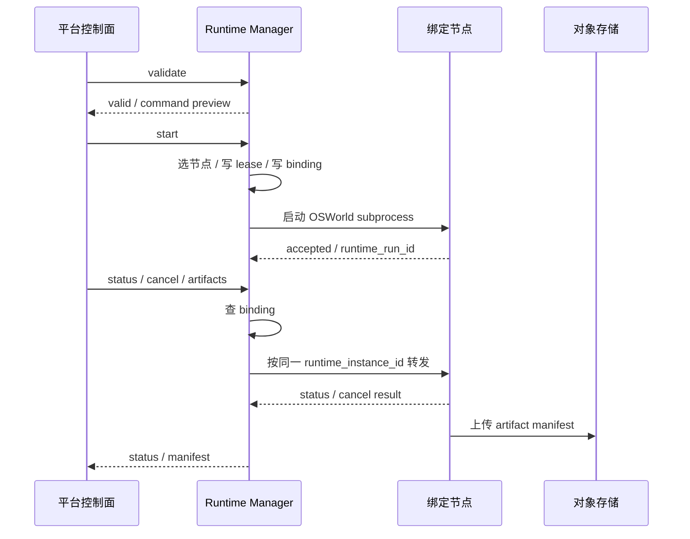

# 接口契约与最小时序

## 先定结论

- `validate / start / status / cancel / artifacts` 就是 OSWorld Runtime 的全部外部语义。
- `runtime_run_id` 识别一次运行，`runtime_instance_id` 识别承载节点，`lease_id` 识别资源占用。
- `status / cancel / artifacts` 必须先查 `runtime_run_bindings` 再路由到绑定节点，不得经过共享域名的随机分发。
- DB 是真相源，Redis 只做缓存或队列加速。

## 表的职责

| 表 | 作用 | 主要写入方 | 主要读取方 |
| --- | --- | --- | --- |
| `runtime_instances` | 节点注册、健康状态、容量快照 | Runtime Manager | Runtime Manager、平台控制面 |
| `resource_leases` | 资源占用和回收 | Runtime Manager / 资源控制器 | Runtime Manager、回收任务 |
| `runtime_tasks` | 一次 run 的任务影子记录 | Runtime Manager | 平台控制面、Runtime Manager |
| `runtime_run_bindings` | run 到节点的粘性绑定 | Runtime Manager | Runtime Manager、status/cancel/artifacts 路由 |

## 建议状态枚举

### `runtime_instances.status`

- `registering`
- `healthy`
- `degraded`
- `unreachable`
- `retired`

### `resource_leases.lease_status`

- `leased`
- `renewing`
- `released`
- `expired`
- `reclaimed`

### `runtime_run_bindings.binding_status`

- `pending`
- `bound`
- `releasing`
- `released`
- `lost`

### `runtime_tasks.status`

- `created`
- `submitted`
- `accepted`
- `queued`
- `running`
- `completed`
- `failed`
- `canceling`
- `canceled`

## 请求流转

### validate

只读，不写任何运行态数据。

作用：

- 校验执行模式、case 选择和资源池配置。
- 检查容量是否足够。
- 返回 sanitized command preview。

### start

写入动作要一起完成，别拆成几步让状态中间悬空。

推荐顺序：

1. 选择健康节点。
2. 创建 `runtime_tasks` 记录。
3. 在同一事务里写 `resource_leases` 和 `runtime_run_bindings`。
4. 启动 OSWorld subprocess。
5. 把 `runtime_run_id`、`base_url_snapshot`、`lease_id` 落库。

### status

1. 先查 `runtime_run_bindings`。
2. 再查 `runtime_instances` 的最新地址和心跳。
3. 用绑定节点的 `base_url` 查询状态。
4. 如果节点不可达，返回 `runtime_unreachable` 或 `runtime_lost`。

禁止：

- 让共享域名做随机分发。
- 让另一个节点代查状态。
- 直接读别的节点本地目录。

### cancel

1. 先查绑定。
2. 再把取消请求发到同一台绑定节点。
3. 取消动作必须幂等。
4. 已终态任务再次 cancel，直接回当前状态。

### artifacts

1. 优先读取已经上传到共享对象存储的 manifest。
2. 如果 manifest 不完整，显式标记 `missing_artifacts` 或 `upload_error`。
3. 本地目录只允许 smoke 使用，不能当多机场景的默认兜底。

## 最小时序

## 失败收敛

- 节点失联时，不自动切到另一台机器继续查、继续 cancel、继续拉产物。
- 租约过期后，由回收任务接管，别指望本地文件自己恢复。
- 产物如果没上传成功，必须把缺口显式暴露出来，不能假装成功。

## 结论

这套链路最核心的是两件事：

1. `runtime_run_id -> runtime_instance_id` 绑定不能漂。
2. `status / cancel / artifacts` 必须沿绑定路由回同一台实例。
