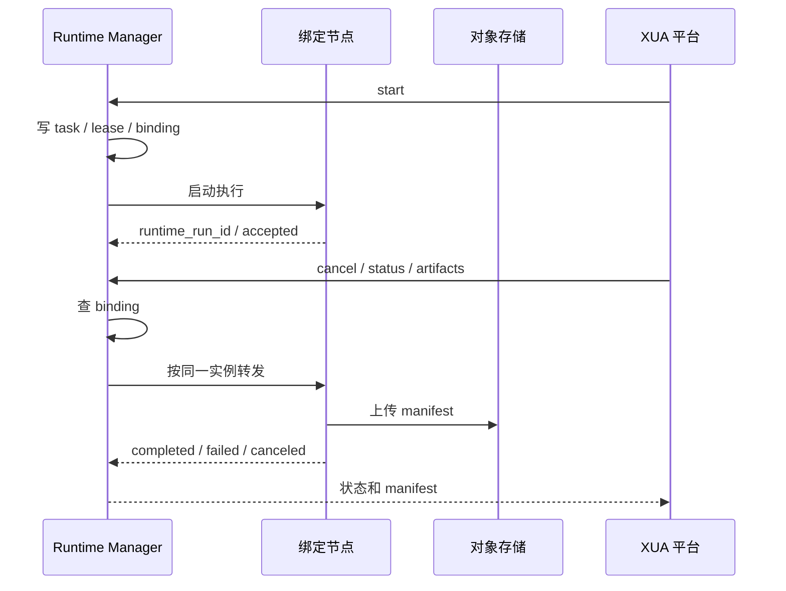

# 状态机与故障收敛

## 先定结论

- Runtime Manager 只收敛执行面状态，不收敛平台 `EvaluationRun` 状态。
- `runtime_run_id -> runtime_instance_id` 一旦绑定，不允许漂移到别的节点。
- `status / cancel / artifacts` 都必须先查 `runtime_run_bindings`，再路由到同一台绑定节点。
- `resource_leases` 和 `runtime_run_bindings` 是收敛辅助，不是最终结果本身。
- artifact 的成功标准是对象存储里有可读的 manifest，不是本机目录里碰巧有文件。

## 收敛边界

| 对象 | 收敛者 | 终态 | 说明 |
| --- | --- | --- | --- |
| `runtime_instances` | Runtime Manager | `retired` | 节点心跳、健康和容量状态收敛 |
| `runtime_tasks` | Runtime Manager | `completed` / `failed` / `canceled` | 单次运行的执行面状态收敛 |
| `runtime_run_bindings` | Runtime Manager | `released` / `lost` | run 到实例的粘性路由收敛 |
| `resource_leases` | Runtime Manager / 资源控制器 | `released` / `reclaimed` | 资源占用和回收收敛 |
| `evaluation_runs` | XUA 平台 | `completed` / `failed` / `canceled` | 平台侧业务结果收敛 |

## `runtime_instances` 状态机

```text
registering
  -> healthy
  -> degraded
  -> unreachable
  -> retired

healthy
  -> degraded
  -> unreachable
  -> retired

degraded
  -> healthy
  -> unreachable
  -> retired

unreachable
  -> healthy
  -> retired
```

### 语义

- `registering`：节点刚注册，尚未完成可用性确认。
- `healthy`：可接新单。
- `degraded`：可读但不宜新接单，通常是容量紧张、健康检查异常或人工降级。
- `unreachable`：心跳失效或健康检查失败，可恢复，不是终态。
- `retired`：已退役，不再接单。

### 收敛规则

- `last_heartbeat_at + heartbeat_ttl_seconds` 超时后，节点进入 `unreachable`。
- `unreachable` 节点恢复心跳后，可以回到 `healthy`。
- 只有人工下线、版本不兼容或明确退役时，节点才进 `retired`。
- `status_reason` 记录最近一次状态变化原因，常见值包括 `heartbeat_timeout`、`manual_drain`、`capacity_mismatch`、`manual_retire`。

## `runtime_tasks` 状态机

```text
created
  -> submitted
  -> accepted
  -> queued
  -> running
  -> completed

submitted / accepted / queued / running
  -> canceling
  -> canceled

submitted / accepted / queued / running
  -> failed
```

### 语义

- `created`：平台已建任务影子记录，尚未提交给 Runtime。
- `submitted`：请求已经发出，等待 Runtime 接受。
- `accepted`：Runtime 已接收，尚未真正跑起来。
- `queued`：已排队，等待执行。
- `running`：正在执行。
- `completed`：正常终态，结果和 manifest 已归档。
- `canceling`：已收到取消请求，正在让同一节点收敛。
- `canceled`：取消完成。
- `failed`：执行失败、超时、节点失联或产物上传失败。

### 收敛规则

- `validation_error`、`capacity_exceeded` 这类问题，通常在 `submitted` 前就能判死，直接进 `failed`。
- `runtime_error`、`timeout`、`runtime_lost`、`upload_error`、`artifact_missing` 都应该收敛到 `failed`。
- `canceling` 不是终态，Runtime 收到取消后必须继续轮询，直到 `canceled` 或 `failed`。
- 已终态任务再次取消，直接返回当前状态，不再发第二次执行请求。

## `runtime_run_bindings` 状态机

```text
pending
  -> bound
  -> releasing
  -> released
  -> lost

bound
  -> releasing
  -> released
  -> lost

releasing
  -> released
  -> lost
```

### 语义

- `pending`：绑定记录已创建，但还没完成节点确认。
- `bound`：run 已粘到某台实例，后续 `status / cancel / artifacts` 都走这条路。
- `releasing`：任务已终态，正在做收尾释放。
- `released`：绑定已归档。
- `lost`：绑定节点失联，或者绑定无法再被可靠使用。

### 收敛规则

- `runtime_run_id` 只能绑定一个 `runtime_instance_id`。
- 绑定一旦 `bound`，就不能迁移到另一台节点。
- 节点失联后，绑定只能进入 `lost`，不能自动漂移。
- `binding_reason` 记录 `bound`、`release_requested`、`node_lost`、`manual_retire` 这类原因。

## `resource_leases` 状态机

```text
leased
  -> renewing
  -> released
  -> expired

renewing
  -> leased
  -> released
  -> expired

expired
  -> reclaimed
```

### 语义

- `leased`：资源被占用。
- `renewing`：正在保活或续约。
- `released`：正常释放。
- `expired`：TTL 到期。
- `reclaimed`：回收任务已经接管。

### 收敛规则

- 续约成功后，状态回到 `leased`，`renewed_at` 和 `heartbeat_at` 一起刷新。
- `lease_expires_at` 超时后进入 `expired`。
- `expired` 资源必须由回收任务兜底到 `reclaimed`。
- `lease_reason` 记录 `acquired`、`renewed`、`released`、`expired`、`reclaimed`。

## 绑定与租约联动

1. `start` 成功时，先在事务里写 `resource_leases`，再写 `runtime_run_bindings`。
2. `runtime_run_bindings.bound` 之后，`status / cancel / artifacts` 只能沿 `base_url_snapshot` 路由。
3. 正常终态时，先把 binding 置为 `releasing`，再把 lease 置为 `released`，最后把 binding 置为 `released`。
4. 节点失联时，binding 直接进入 `lost`，lease 先过期再由回收任务置为 `reclaimed`。
5. `lease_owner`、`resource_ref`、`base_url_snapshot` 都要保留到终态，方便排障和审计。

## 异常收敛场景

### 节点心跳丢失

1. `runtime_instances` 进入 `unreachable`。
2. 未终态的 `runtime_tasks` 进入 `failed` 或保持 `canceling` 等待最终轮询。
3. 对应 `runtime_run_bindings` 进入 `lost`。
4. 对应 `resource_leases` 进入 `expired`，随后被回收任务接管到 `reclaimed`。
5. 平台侧只接收 `runtime_unreachable`、`runtime_lost` 或 `runtime_error`，不自动换节点继续跑。

### 取消请求

1. 平台先查 `runtime_run_bindings`。
2. 取消请求只发到同一台绑定节点。
3. 节点可达时，任务进入 `canceling`，最终收敛到 `canceled` 或 `failed`。
4. 节点不可达时，不允许改路由到另一台节点补 cancel。

### 产物上传失败

1. 任务结束后必须产出 manifest。
2. manifest 不完整或对象存储上传失败，任务不能伪装成 `completed`。
3. 这类问题收敛到 `failed`，原因用 `upload_error` 或 `artifact_missing`。
4. 平台侧后续 ingest 只能看到明确失败，不要猜目录补数据。

### 节点重启或重新注册

1. 如果是同一台节点的稳定身份复用，更新 `base_url` 和健康快照即可。
2. 如果节点身份变了，必须当成新 `runtime_instance_id`。
3. 旧 binding 不允许自动迁移到新节点。

## 最小时序



## 结论

这套收敛链路真正要钉死的就三件事：

1. run 只能绑定到一台实例。
2. 节点失联时不允许漂移。
3. 任务终态必须和 manifest 一起收口。
